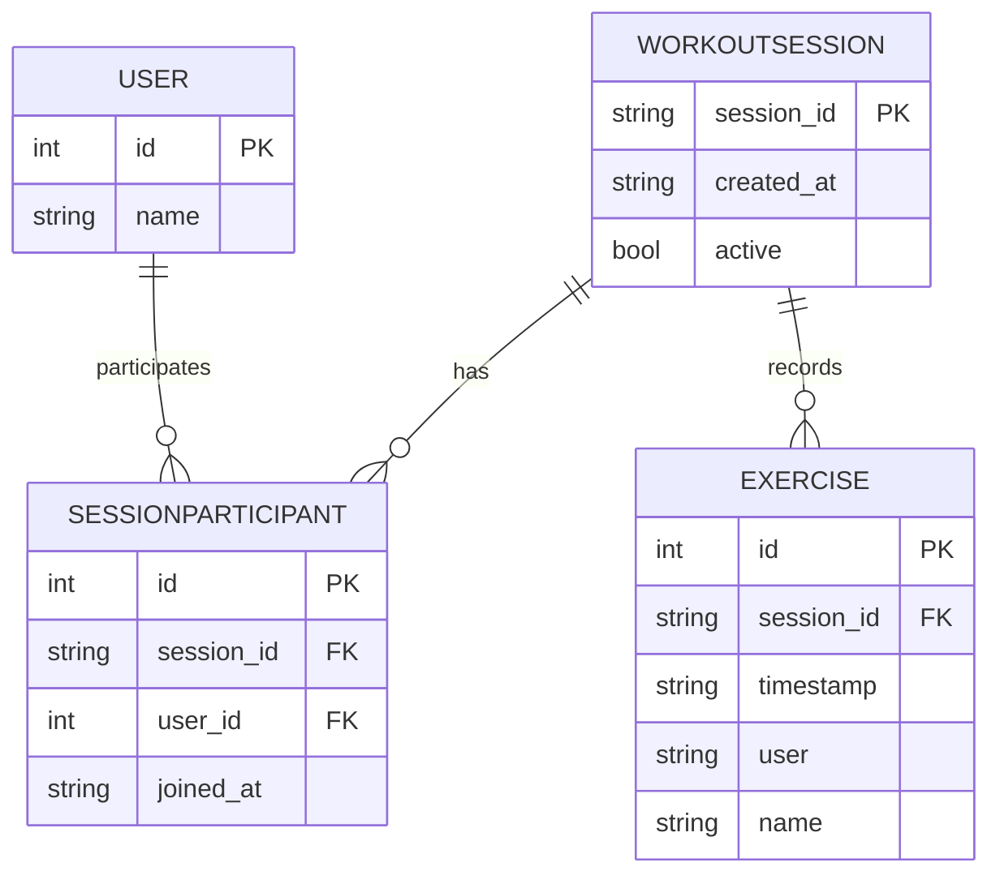

# Real-Time Workout Logger

Real-Time Workout Logger is a small FastAPI app for creating workout sessions, logging exercises, and sharing live updates with everyone connected to the same session.

The project serves a single-page frontend from `static/index.html` and uses SQLite for persistence. Live participant and exercise updates are delivered over WebSockets.

## Features

- Create a new workout session with a short session ID.
- Join an existing session by ID and username.
- Log lifting or cardio exercises into a live feed.
- Broadcast participant changes and new exercise entries in real time.
- View archived workout sessions from the history list.

## Tech Stack

- FastAPI
- Uvicorn
- SQLModel
- SQLite

## Project Structure

- `app.py` - Application entry point.
- `workout_app/main.py` - FastAPI app setup and static file mounting.
- `workout_app/routers.py` - REST API and WebSocket routes.
- `workout_app/models.py` - Database models and request schemas.
- `workout_app/db.py` - Database engine and session helpers.
- `workout_app/config.py` - Database configuration.
- `static/index.html` - Frontend UI.

## Requirements

- Python 3.10 or newer is recommended.
- `pip` for dependency installation.

## Installation

1. Create and activate a virtual environment.

   ```bash
   python -m venv .venv
   source .venv/bin/activate
   ```

2. Install dependencies.

   ```bash
   pip install -r requirements.txt
   ```

## Running the App

Start the development server with Uvicorn:

```bash
uvicorn app:app --reload
```

Then open the app in your browser at `http://127.0.0.1:8000`.

## How It Works

1. Create a session with the "Create New Session" button.
2. Share the session ID with other users.
3. Join the session with a name and start logging exercises.
4. Keep the page open to see live participant updates and exercise logs.

## API Endpoints

- `POST /workouts` - Create a new workout session.
- `POST /workouts/{session_id}/join` - Join a session with JSON body `{ "name": "User" }`.
- `GET /workouts/{session_id}` - Fetch session details, participants, and exercises.
- `POST /workouts/{session_id}/log` - Add an exercise entry.
- `DELETE /workouts/{session_id}` - Archive a session.
- `GET /history` - List all workout sessions.
- `WS /ws/workout/{session_id}` - Stream participant and exercise updates.

## Database

The app uses a local SQLite database file at `database.db`. Tables are created automatically on startup.

Core tables:

- `user` - Persistent users by name.
- `workoutsession` - Session metadata and active flag.
- `sessionparticipant` - Join table linking users to sessions.
- `exercise` - Logged exercise entries.

## Notes

- The frontend is intentionally simple and self-contained.
- Archived sessions stay in history, but live connections are cleared when a session is archived.
- The WebSocket client automatically retries with backoff and re-joins on reconnect.

---

**System Overview and Architecture**

Overview

- Purpose: Provide a lightweight real-time workout logging service where users create short-lived sessions, join with a display name, and log exercises (lifting or cardio) that are broadcast to everyone connected to the same session.
- Primary users: exercise partners, coaches, or small group classes who want a shared live feed of exercises and participants.
- Key features: session creation, join-by-name, exercise logging, live participant/exercise broadcast via WebSocket, session archival, and history listing.

Architecture (high-level)

```mermaid
flowchart LR
   Browser[Client (Browser)] -->|HTTP| Frontend[static/index.html]
   Browser -->|WS /ws/workout/:id| WebSocketServer((FastAPI WebSocket))
   Frontend -->|REST API| API[FastAPI REST Endpoints]
   API --> DB[(SQLite database)]
   WebSocketServer -. broadcasts .-> Browser
   note right of DB: SQLModel / SQLAlchemy
```

Notes: The app is a single-process FastAPI application that serves the SPA and backs it with SQLite via SQLModel. The current WebSocket connection registry is in-memory, which is suitable for development and single-worker deployments only.

---

**API Documentation**

All endpoints are available in the generated OpenAPI UI at `/docs` (FastAPI default) and `/openapi.json`.

- `POST /workouts` — Create session
   - Description: Create a new workout session with a short session ID.
   - Request: none
   - Response: 201 `{ "session_id": "<id>" }`

- `POST /workouts/{session_id}/join` — Join session
   - Description: Add a participant (by name) to a session; creates persistent `User` if needed.
   - Request body: `{ "name": "Alice" }`
   - Responses: 200 session info; 404 if session missing/inactive
   - Example cURL:

```bash
curl -X POST -H "Content-Type: application/json" -d '{"name":"Alice"}' http://127.0.0.1:8000/workouts/abcd1234/join
```

- `GET /workouts/{session_id}` — Get session details
   - Returns: session metadata, `participants` (list of names), and `exercises` (list of exercise records).
   - Responses: 200 or 404

- `POST /workouts/{session_id}/log` — Log an exercise
   - Description: Append an exercise entry to the session. Auto-adds participant if not already joined.
   - Request body (example):

```json
{
   "type": "lifting",
   "name": "Bench Press",
   "sets": 3,
   "reps": 8,
   "weight": 185.0,
   "user": "Alice"
}
```

   - Responses: 201 created `Exercise` object, 404 if session missing/inactive
   - Broadcast: After create, backend broadcasts the created exercise object to WebSocket clients connected to the session.

- `DELETE /workouts/{session_id}` — Archive session
   - Marks session inactive, clears live connections, and returns `{ "message": "Session archived" }`.

- `GET /history` — List all sessions
   - Returns sessions ordered by creation time (newest first).

- WebSocket: `WS /ws/workout/{session_id}`
   - On connect: server accepts, validates session exists and is active, and sends `{ "type": "participants", "data": [...] }`.
   - Broadcasts: participant list updates and exercise objects are sent as JSON to connected clients.
   - Error codes: server will send an error JSON and close with code 1008 if the session is not active.

Authentication

- The application currently has no authentication: user identity is a free-form `name` string. This is intentional for the scope of this exercise but should be replaced by a proper authentication/authorization layer for production (JWT, OAuth, etc.).

OpenAPI

- FastAPI automatically generates OpenAPI / Swagger docs. The README here documents the endpoints and the relationship to the generated docs: use `/docs` to view interactive examples and schema details for each endpoint and model.

---

**Data Model & Business Rules**

Entities

- `User`: persistent user record, unique by `name`.
- `WorkoutSession`: identified by `session_id` (short UUID), has `created_at` and `active` flag.
- `SessionParticipant`: join table linking `User` to `WorkoutSession`; unique constraint on (`session_id`, `user_id`).
- `Exercise`: recorded exercise entries attached to a `session_id` with timestamp and user name.

Business rules and invariants

- A `User.name` must be unique; attempts to create a duplicate name result in a handled integrity error and re-query.
- `SessionParticipant` enforces uniqueness per user+session via a DB unique constraint.
- Sessions can be archived by setting `active = false`; archived sessions are preserved for history but disallow new joins/logs and live connections are removed.
- Exercise entries require a `user` string and are associated with a `session_id` at creation; the API will create a `User` record if the named user does not exist.

ER Diagram



---

**Deployment & Operations**

Prerequisites

- Python 3.10+ (3.11 recommended)
- `pip` and a virtual environment

Local development setup

1. Create and activate a venv:

```bash
python -m venv .venv
source .venv/bin/activate
```

2. Install dependencies:

```bash
pip install -r requirements.txt
```

3. Run the app (development):

```bash
uvicorn app:app --reload
```

Production recommendations

- Use a production database (Postgres) instead of SQLite for multi-user concurrency.
- Replace the in-memory `connections` registry with a shared pub/sub (Redis) when deploying multiple workers or processes.
- Run the app behind a process manager / ASGI server like `uvicorn` + `gunicorn` (e.g., `gunicorn -k uvicorn.workers.UvicornWorker`).

Logging, monitoring, and maintenance

- Logging: Integrate Python `logging` and configure a file or external log sink; capture request/response logs and exceptions.
- Error handling: FastAPI exception handlers can be registered to provide consistent JSON error formats; unhandled exceptions should be surfaced to monitoring (Sentry, etc.).
- Backups: For SQLite, periodically copy the `database.db` file; for Postgres, use regular dumps.

---

If you'd like, I can also:

- Add a small `docs/architecture.md` file with an expanded diagram and rationale.
- Add automated tests for core endpoints and a CI workflow.


